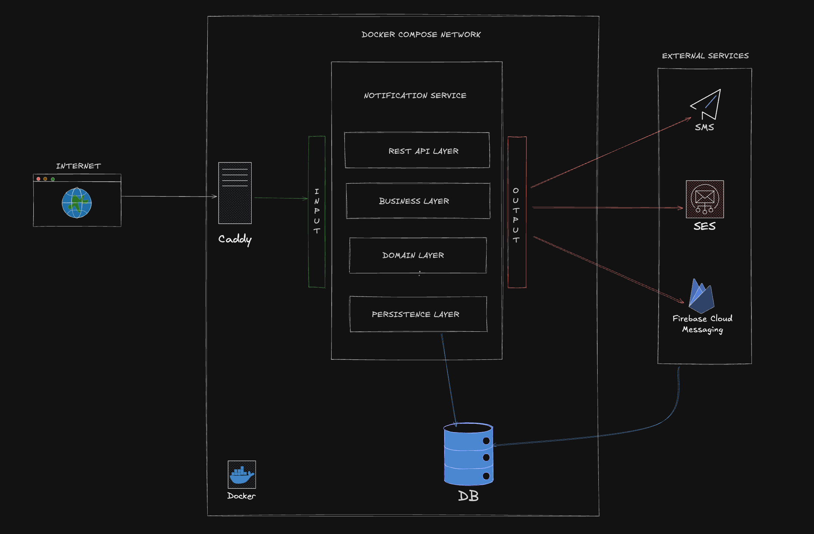

# notification service 
this project is our notification system. it handles sending emails, sms messages, and push notifications. the goal was to build something reliable and flexible so we can easily swap out external services if needed.

## overview
from the start, i wanted something robust and flexible. that's why i went for a hexagonal architecture approach. imagine it like this:

the core brain: this is where our actual notification logic lives. it knows what a notification is, how to decide if it should be sent, and what it should look like. it doesn't care how it gets sent or where the data comes from. it just focuses on the business of notifying.

the action plans: this layer takes requests (like "send a welcome email") and orchestrates the steps. it talks to the brain for decisions and then asks the outside world(specific connections in this case) to do the actual sending or saving.

the outside connections: these are the parts that actually plug into real-world services like databases, email senders, sms provider, or push notification services. the cool thing is, our brain and action plans don't know or care about the specifics of these, they just use the 'connections'. this means we can swap out one service for another service without touching our core logic.

the idea was to practice the concept of DDD, whilst introducing a bit of complexity whilst applying it. for this use case, the separation keeps everything tidy and makes it much easier to test and adapt.

## architecture


## how it works?
when a request comes in (like "send this notification"), it first hits caddy, which is our reverse proxy. caddy takes care of things like https and routing, and then passes the request along to our notification service.
inside the notification service, the request goes through a few layers:
- rest api layer: this is where we handle incoming http requests. it takes the data, does some basic validation, and hands it off to the business logic.
- business layer: here’s where the real work happens. this layer figures out what needs to be done—should we send an email, an sms, a push notification, or maybe all three? it also applies any business rules, like checking user preferences or rate limits.
- domain layer: this is the heart of the system. it knows what a notification is, what it means to send one, and how to track its status. it’s totally unaware of how things get sent out or stored.
- persistence layer: when we need to save or fetch data (like notification history or user preferences), this layer talks to the database. it keeps the rest of the system blissfully ignorant of sql or database details.

once the business logic decides what to do, it uses the output ports to actually send the notification. these are like plug sockets—the business logic just plugs in and doesn’t care what’s on the other end. the actual sending is handled by adapters that talk to real-world services:
- ses for email
- mnotify for sms
- firebase cloud messaging for push notifications

if we ever want to swap out one of these services, we just change the adapter

the database keeps track of everything that’s sent, so we can check statuses, retry failures, and keep a history.
all of this runs inside docker containers, so it’s easy to spin up, test, and deploy anywhere.
in short:
requests come in, get routed, processed, and sent out through whatever channel is needed, all while keeping the core logic clean and easy to maintain.


## requirements
- java 17
- maven
- docker
- git

## tools and services used
- postgresql(prod) and h2(dev)
- caddy(prod)
- aws ses
- mnotify sms
- firebase cloud messaging


## config
```
# database
SPRING_DATASOURCE_URL=jdbc:postgresql://postgres:5432/notification_service
SPRING_DATASOURCE_USERNAME=postgres
SPRING_DATASOURCE_PASSWORD=password

# aws ses (email)
AWS_SES_ACCESS_KEY=your-aws-access-key
AWS_SES_SECRET_KEY=your-aws-secret-key
AWS_SES_REGION=us-east-1
AWS_SES_FROM_ADDRESS=noreply@yourdomain.com

# mnotify (sms)
MNOTIFY_API_KEY=your-mnotify-api-key
MNOTIFY_API_URL=https://api.mnotify.com/api
MNOTIFY_SENDER=YourApp

# firebase (push)
FIREBASE_PROJECT_ID=your-firebase-project-id
FIREBASE_CREDENTIALS_PATH=/app/firebase-credentials.json

# app
SPRING_PROFILES_ACTIVE=prod
```

## production configuration: email, sms, and push credentials

### 1. AWS SES (Email)
- **Docs:** [Amazon SES](https://aws.amazon.com/ses/)
- **What you need:**
  - Access Key ID
  - Secret Access Key
  - Region (e.g., `us-east-1`)
- **How to get:**
  1. Create an IAM user in AWS with SES permissions.
  2. Download the Access Key ID and Secret Access Key.
  3. Verify your sender email/domain in the SES console.
- **How to configure:**
  - In `application-prod.properties` or as environment variables:
    ```properties
    aws.ses.access-key=YOUR_AWS_ACCESS_KEY_ID
    aws.ses.secret-key=YOUR_AWS_SECRET_ACCESS_KEY
    aws.ses.region=us-east-1
    ```
  - In Docker Compose:
    ```yaml
    environment:
      - AWS_SES_ACCESS_KEY=YOUR_AWS_ACCESS_KEY_ID
      - AWS_SES_SECRET_KEY=YOUR_AWS_SECRET_ACCESS_KEY
      - AWS_SES_REGION=us-east-1
    ```

### 2. MNotify SMS
- **Docs:** [MNotify SMS API](https://readthedocs.mnotify.com/#tag/SMS)
- **What you need:**
  - API Key (from your MNotify dashboard)
  - Sender Name (registered with MNotify)
  - API URL (usually `https://api.mnotify.com/api`)
- **How to get:**
  1. Sign up at [MNotify](https://app.mnotify.com/).
  2. Go to the API section in your dashboard.
  3. Copy your API key and register a sender name.
- **How to configure:**
  - In `application-prod.properties` or as environment variables:
    ```properties
    mnotify.api.key=YOUR_MNOTIFY_API_KEY
    mnotify.api.url=https://api.mnotify.com/api
    mnotify.sender=YourSenderName
    ```
  - In Docker Compose:
    ```yaml
    environment:
      - MNOTIFY_API_KEY=YOUR_MNOTIFY_API_KEY
      - MNOTIFY_API_URL=https://api.mnotify.com/api
      - MNOTIFY_SENDER=YourSenderName
    ```

### 3. Firebase Cloud Messaging (FCM)
- **Docs:** [Firebase Admin Setup](https://firebase.google.com/docs/admin/setup), [Medium FCM Guide](https://medium.com/@dev.arunengineer/setup-for-push-notification-message-using-firebase-6d59ad618527)
- **What you need:**
  - Firebase Service Account JSON file
- **How to get:**
  1. Go to [Firebase Console](https://console.firebase.google.com/).
  2. Select your project (or create one).
  3. Go to Project Settings → Service Accounts.
  4. Click "Generate new private key" and download the JSON file.
- **How to configure:**
  - Set the environment variable `GOOGLE_APPLICATION_CREDENTIALS` to the path of the JSON file.
  - In Docker Compose:
    ```yaml
    volumes:
      - ./firebase-service-account.json:/app/firebase-service-account.json
    environment:
      - GOOGLE_APPLICATION_CREDENTIALS=/app/firebase-service-account.json
    ```


